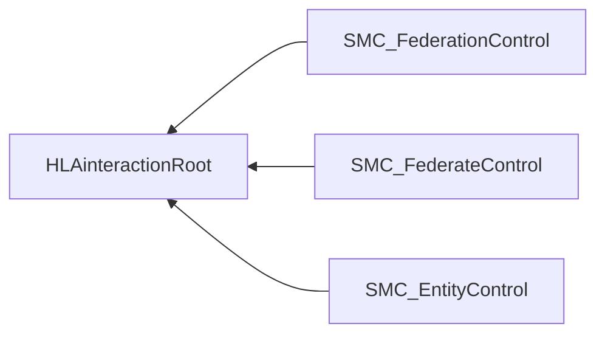

# NETN-SMC
|Version| Date| Dependencies|
|---|---|---|
|1.0|2023-11-17||

Description of New Module

## Interaction Classes

Note that inherited and dependency parameters are not included in the description of interaction classes.

### SMC_FederateControl

Base class for all control actions directed to a specific federate.

|Parameter|Datatype|Semantics|
|---|---|---|
|Federate|FederateName|Required: The federate indented as the receiver of this control action.|

### SMC_EntityControl

|Parameter|Datatype|Semantics|
|---|---|---|
|Entity|UUID||
